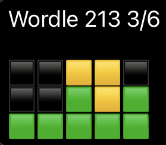

# Boredle

## A small collection of tools to help solve the daily puzzle by [Wordle](https://www.powerlanguage.co.uk/wordle/ "Guess the Wordle in 6 tries")

This is a small collection of a few functions that I wrote in order to finally succeed at a word game. At this time these functions are standalone and have no defined order or flow. At its inception, these functions are all being ran from REPL as I progress. The  My goal for this repo is to take it from a few standalone functions that are ran in a semi-random order to a structured tool, optemized to give the best possible chance of solving the puzzle in as few turns as possible. I welcome any feedback or PR, this is my first public repo, please be gentle, or don't, I'm not your momma. If you've read this far, thanks for your time and I hope at least one other person finds this repo helpful.

Copyright 2022 Matt Burnside <matt_codes@outlook.com>

Permission is hereby granted, free of charge, to any person obtaining a copy of this software and associated documentation files (the "Software"), to deal in the Software without restriction, including without limitation the rights to use, copy, modify, merge, publish, distribute, sublicense, and/or sell copies of the Software, and to permit persons to whom the Software is furnished to do so, subject to the following conditions:

The above copyright notice and this permission notice shall be included in all copies or substantial portions of the Software.

THE SOFTWARE IS PROVIDED "AS IS", WITHOUT WARRANTY OF ANY KIND, EXPRESS OR IMPLIED, INCLUDING BUT NOT LIMITED TO THE WARRANTIES OF MERCHANTABILITY, FITNESS FOR A PARTICULAR PURPOSE AND NONINFRINGEMENT. IN NO EVENT SHALL THE AUTHORS OR COPYRIGHT HOLDERS BE LIABLE FOR ANY CLAIM, DAMAGES OR OTHER LIABILITY, WHETHER IN AN ACTION OF CONTRACT, TORT OR OTHERWISE, ARISING FROM, OUT OF OR IN CONNECTION WITH THE SOFTWARE OR THE USE OR OTHER DEALINGS IN THE SOFTWARE.
